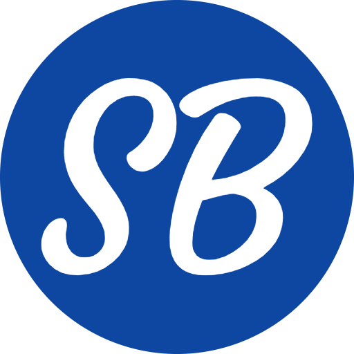

# <div align="center">Professional Portfolio</div>

<div align="center">
  
  
  [](https://nextjs.org/)
  [](https://www.typescriptlang.org/)
  [](https://tailwindcss.com/)
  [](https://www.framer.com/motion/)
  
  <p>
    <a href="https://github.com/sumanbisunkhe"></a>
    <a href="https://www.linkedin.com/in/suman-bisunkhe/"></a>
    <a href="https://twitter.com/sumanbisunkhe"></a>
    <a href="https://www.instagram.com/sumanbisunkhe/"></a>
  </p>
  
  <p>
    <a href="https://sumanbisunkhe.github.io/professional-portfolio/"></a>
    <a href="https://github.com/sumanbisunkhe/professional-portfolio/stargazers"></a>
    <a href="https://github.com/sumanbisunkhe/professional-portfolio/network/members"></a>
    <a href="https://github.com/sumanbisunkhe/professional-portfolio/issues"></a>
  </p>
</div>

---

## 🌟 Overview

<div align="center">
  
</div>

A modern, responsive portfolio website built with Next.js 13, TypeScript, and Tailwind CSS. This portfolio showcases my skills, projects, and professional experience with a sleek and interactive user interface. The site features smooth animations, dark/light mode, and a fully responsive design that works on all devices.

## ✨ Features

<table>
  <tr>
    <td width="50%">
      <h3>🎨 Design & UI</h3>
      <ul>
        <li><b>Modern Design</b>: Clean and professional layout with smooth animations</li>
        <li><b>Dark/Light Mode</b>: Seamless theme switching with persistent preferences</li>
        <li><b>Responsive</b>: Fully responsive design that works on all devices</li>
        <li><b>Interactive UI</b>: Engaging user interface with Framer Motion animations</li>
        <li><b>Custom Cursor</b>: Stylish mouse follower with interactive effects</li>
      </ul>
    </td>
    <td width="50%">
      <h3>🛠️ Functionality</h3>
      <ul>
        <li><b>Contact Form</b>: Integrated email functionality for direct communication</li>
        <li><b>Resume Download</b>: Easy access to downloadable resume</li>
        <li><b>Loading Animation</b>: Stylish loading screen with animated text</li>
        <li><b>Music Player</b>: Background music with playlist functionality</li>
        <li><b>Project Showcase</b>: Detailed display of my work and achievements</li>
      </ul>
    </td>
  </tr>
</table>

## 🚀 Technologies Used

<div align="center">
  
  
  
  
  
  
  
  
</div>

## 📸 Screenshots

<div align="center">
  
  
  <p><i>More screenshots coming soon!</i></p>
</div>

## 🛠️ Installation

1. **Clone the repository:**
   ```bash
   git clone https://github.com/sumanbisunkhe/professional-portfolio.git
   ```

2. **Navigate to the project directory:**
   ```bash
   cd professional-portfolio
   ```

3. **Install dependencies:**
   ```bash
   npm install
   # or
   yarn install
   # or
   pnpm install
   ```

4. **Create a `.env.local` file in the root directory and add your email configuration:**
   ```
   EMAIL_PASS=your_email_password_here
   ```

5. **Run the development server:**
   ```bash
   npm run dev
   # or
   yarn dev
   # or
   pnpm dev
   ```

6. **Open [http://localhost:3000](http://localhost:3000) in your browser.**

## 📁 Project Structure

```
professional-portfolio/
├── app/                  # Next.js app directory
│   ├── api/             # API routes
│   │   └── contact/     # Contact form API
│   ├── resume/          # Resume page
│   ├── globals.css      # Global styles
│   ├── layout.tsx       # Root layout
│   ├── loading.tsx      # Loading component
│   └── page.tsx         # Home page
├── components/          # React components
│   ├── ui/             # UI components
│   ├── loading-animation.tsx  # Loading animation
│   ├── left-sidebar.tsx      # Left sidebar
│   ├── right-sidebar.tsx     # Right sidebar
│   ├── mode-toggle.tsx       # Theme toggle
│   ├── mouse-follower.tsx    # Custom cursor
│   ├── stylish-logo.tsx      # Logo component
│   └── theme-provider.tsx    # Theme provider
├── hooks/              # Custom React hooks
│   ├── use-mobile.tsx # Mobile detection
│   └── use-toast.ts   # Toast notifications
├── lib/                # Utility functions
│   └── utils.ts       # Utility functions
├── public/             # Static assets
│   ├── audio/         # Audio files
│   ├── docs/          # Documents
│   │   └── sumanbisunkhe-resume.pdf  # Resume
│   └── favicon/       # Favicon images
└── styles/            # Global styles
```

## 🔧 Configuration

The project uses several configuration files:

- `next.config.mjs`: Next.js configuration
- `tailwind.config.ts`: Tailwind CSS configuration
- `tsconfig.json`: TypeScript configuration
- `.env.local`: Environment variables (not tracked by Git)

## 📝 License

This project is licensed under the MIT License - see the [LICENSE](LICENSE) file for details.

## 👤 Author

<div align="center">
  
  
  <h3>Suman Bisunkhe</h3>
  <p>Full Stack Developer | UI/UX Enthusiast | Open Source Contributor</p>
  
  <p>
    <a href="https://github.com/sumanbisunkhe"></a>
    <a href="https://www.linkedin.com/in/suman-bisunkhe/"></a>
    <a href="https://twitter.com/sumanbisunkhe"></a>
    <a href="https://www.instagram.com/sumanbisunkhe/"></a>
  </p>
</div>

## 🙏 Acknowledgments

- [Next.js](https://nextjs.org/) for the amazing framework
- [Tailwind CSS](https://tailwindcss.com/) for the utility-first CSS framework
- [Framer Motion](https://www.framer.com/motion/) for the animation library
- [Shadcn UI](https://ui.shadcn.com/) for the beautiful UI components
- [Lucide Icons](https://lucide.dev/) for the beautiful icons
- [Nodemailer](https://nodemailer.com/) for the email functionality

## 📊 GitHub Stats

<div align="center">
  
  
</div>

<div align="center">
  
  
</div>

---

<div align="center">
  <p>Made with ❤️ by Suman Bisunkhe</p>
  <p>© 2024 All Rights Reserved</p>
</div> 